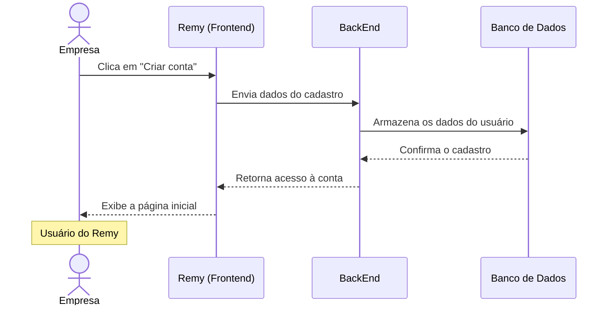

# Cadastro de Empresa

```mermaid
sequenceDiagram
actor U as Empresa
participant A as Remy (Frontend)
participant B as BackEnd
participant C as Banco de Dados

U->>A: Clica em "Criar conta"
A->>B: Envia dados do cadastro
B->>C: Armazena os dados do usuário
C-->>B: Confirma o cadastro
B-->>A: Retorna acesso à conta
A-->>U: Exibe a página inicial

Note over U: Usuário do Remy
```
