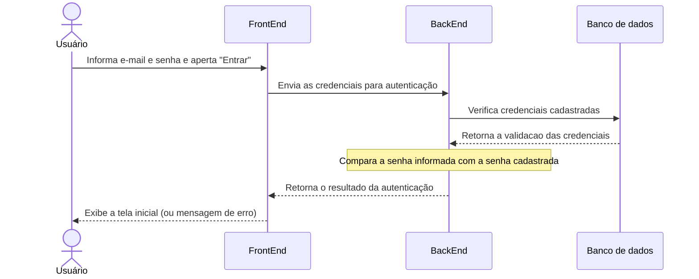

## UML da Tela de Login

```mermaid
sequenceDiagram
    actor Usuario as Usuário
    participant FrontEnd
    participant BackEnd
    participant BD as Banco de dados

    Usuario->>FrontEnd: Informa e-mail e senha e aperta "Entrar"
    FrontEnd->>BackEnd: Envia as credenciais para autenticação
    BackEnd->>BD: Verifica credenciais cadastradas
    BD-->>BackEnd: Retorna a validacao das credenciais
    Note over BackEnd: Compara a senha informada com a senha cadastrada
    BackEnd-->>FrontEnd: Retorna o resultado da autenticação
    FrontEnd-->>Usuario: Exibe a tela inicial (ou mensagem de erro)
```
